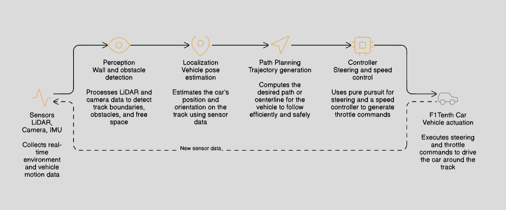

::: {.hero-section}

# Mad Max F1Tenth {.title}

::: {.subtitle}
Using sensors and controllers to autonomously drive an F1Tenth car around the track as fast and safely as possible.
:::

::: {.author-list}

[**Pranav Balasubramanian**](https://github.com/pranav-balasubramanian)^1^,
[**Siddarth Pattisapu**](https://github.com/sp110-ece)^2^,
[**Soumil Kushwaha**](https://example.com)^1,2^

:::

::: {.affiliation-list}

^1^University of Illinois Urbana-Champaign,  ^2^ECE 484 - Principles of Safe Autonomy

:::

::: {.button-row}

<!-- [[ Paper]{.btn-text}](https://arxiv.org/pdf/XXXX.XXXXX){.btn .btn-primary} -->
<!-- [[ arXiv]{.btn-text}](https://arxiv.org/abs/XXXX.XXXXX){.btn .btn-primary} -->
[[ Video]{.btn-text}](https://www.youtube.com/watch?v=cSQTZoZPJzs){.btn .btn-primary}
[[ Code]{.btn-text}](https://github.com/){.btn .btn-primary}
<!-- [[ Data]{.btn-text}](https://example.com){.btn .btn-primary} -->

:::

:::


<!-- ============================================================ -->
<!-- TEASER IMAGE / VIDEO -->
<!-- ============================================================ -->

::: {.section-container}

::: {.hero-teaser}

<!-- Option A: Use a static image as the teaser -->
{.teaser-img}

<!-- Option B: Embed a video teaser (uncomment below, comment out image above)

-->

:::

:::


<!-- ============================================================ -->
<!-- ABSTRACT -->
<!-- ============================================================ -->

::: {.section-container}

## Abstract {.section-title}

::: {.abstract-text}
This project develops an autonomous control system for an **F1Tenth race car** to complete a three-lap **time trial** as quickly and reliably as possible. The primary challenge is enabling the vehicle to navigate a track at high speed while avoiding collisions using only onboard sensors such as **LiDAR, camera, and IMU**. Because penalties are applied for crashes and rescues, the system must balance **speed, stability, and safety**.

Our approach focuses on building a modular autonomous driving pipeline consisting of **perception, localization, path planning, and control**. LiDAR data is used to detect track boundaries and obstacles, allowing the system to estimate the drivable corridor. From this information, a path planning module determines an optimal trajectory along the track center while accounting for curvature and available space. A **pure pursuit controller** then computes steering commands based on a lookahead point along the planned path, while a speed controller adjusts velocity depending on track conditions and turning radius.

The system is developed and tested within the F1Tenth simulator before deployment on the physical vehicle. Through simulation experiments and iterative tuning, we aim to achieve fast lap times while maintaining robust performance under varying track conditions. The final goal is a reliable autonomous racing system capable of completing the course with **minimal penalties and competitive completion times**.

:::

:::


<!-- ============================================================ -->
<!-- OVERVIEW / METHOD VIDEO -->
<!-- ============================================================ -->

::: {.section-container}

## Video {.section-title}

::: {.video-container}
<!-- Replace with your YouTube or local video embed -->

:::

:::


<!-- ============================================================ -->
<!-- RESULTS GALLERY -->
<!-- ============================================================ -->
<!--
::: {.section-container}

## Results {.section-title}

::: {.content-text}
Provide a brief description of the results shown below. Explain what the
reader should observe and why it matters.
:::

::: {.results-grid}

::: {.result-card}

:::

::: {.result-card}

:::

::: {.result-card}

:::

:::

:::
-->

<!-- ============================================================ -->
<!-- QUALITATIVE COMPARISONS -->
<!-- ============================================================ -->
<!--
::: {.section-container}

## Qualitative Comparisons {.section-title}

::: {.content-text}
Describe the comparison setup — which baselines are you comparing against, and
what should the reader look for in the side-by-side results.
:::

::: {.comparison-grid}

::: {.comparison-item}


**Ours**
:::

::: {.comparison-item}


**Baseline A**
:::

:::

:::
-->

<!-- ============================================================ -->
<!-- INTERACTIVE SLIDER (Optional) -->
<!-- ============================================================ -->
<!--
::: {.section-container}

## Interpolation Demo {.section-title}

::: {.content-text}
If your method supports interpolation or continuous control, you can add an
interactive slider here. The example below shows how to set one up.
:::

::: {.interpolation-panel}

::: {.interpolation-endpoints}
{.endpoint-img}

{.endpoint-img}
:::

<input type="range" min="0" max="100" value="50" class="interpolation-slider" id="interpolation-slider">
<div id="interpolation-value" class="interpolation-value">50%</div>

<script>
  const slider = document.getElementById('interpolation-slider');
  const display = document.getElementById('interpolation-value');
  slider.addEventListener('input', function() {
    display.textContent = this.value + '%';
  });
</script>

:::

:::
-->

<!-- ============================================================ -->
<!-- RELATED WORK -->
<!-- ============================================================ -->

::: {.section-container}

## Related Work {.section-title}

::: {.content-text}

Here are some related works in this area:

- [F1tenth Autonomous Racing With Offline Reinforcement Learning Methods](https://arxiv.org/abs/2408.04198) introduces an idea similar to ours for Autonomous F1Tenth racing using reinforcement learning.
<!-- - [Related Paper 2](https://example.com) also addresses [problem] using [approach]. -->
<!-- - [Related Paper 3](https://example.com) proposes [technique] which is complementary to our method. -->

<!-- Check out [this survey](https://example.com) for a comprehensive overview of the field. -->
:::

:::


<!-- ============================================================ -->
<!-- BIBTEX -->
<!-- ============================================================ -->

::: {.section-container}

## BibTeX {.section-title}

```bibtex
@article{MadMaxF1Tenth,
  author    = {Pranav Balasubramanian and Siddarth Pattisapu and Soumil Kushwaha},
  title     = {Mad Max F1Tenth Racer},
  year      = {2026},
}
```

:::


<!-- ============================================================ -->
<!-- FOOTER -->
<!-- ============================================================ -->

::: {.site-footer}

This website template is adapted from the
[Nerfies](https://nerfies.github.io) project page, which is licensed under a
[Creative Commons Attribution-ShareAlike 4.0 International License](http://creativecommons.org/licenses/by-sa/4.0/).

:::
